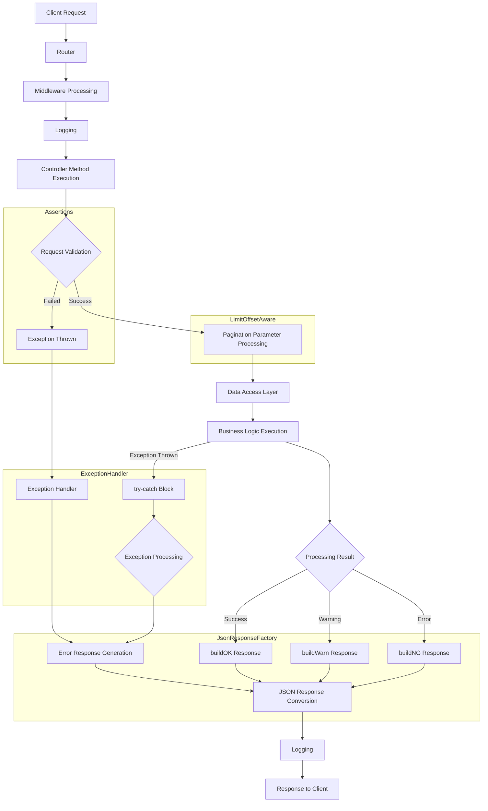

# ts3-base-controller

# バックエンド ベースコントローラー

## 概要

このプロジェクトのバックエンドAPIは、すべてのAPIエンドポイントに共通の機能を提供する階層的なコントローラー構造に基づいて構築されています。ベースコントローラーシステムは、特殊な機能のための様々なトレイトを持つ階層的な継承構造で構成されています。

## コントローラー階層

```
Laravel BaseController
     ↑
StubController (ベースコントローラー)
     ↑
ApiController
     ↑
特定のAPIコントローラー
```

## 全体処理フロー図

以下の図はベースコントローラーを使用した全体的なリクエスト処理フローを示しています：



この図は、リクエストがルーターを通過し、ミドルウェア処理を経て、StubControllerから継承された機能を利用してAPIリクエストを処理する全体的な流れを示しています。処理の各段階では、必要に応じてログが記録されます。

## 主要コンポーネント

### 1. StubController

`app/Contracts/Http/Controllers/StubController.php`に位置し、すべてのAPIコントローラーが継承する主要なベースコントローラーです。LaravelのBaseControllerを拡張し、複数の有用なトレイトを組み込んでいます。

```php
namespace W3\Contracts\Http\Controllers;

use Carbon\Carbon;
use Illuminate\Foundation\Bus\DispatchesJobs;
use Illuminate\Foundation\Validation\ValidatesRequests;
use Illuminate\Routing\Controller as BaseController;
use W3\Helpers\Assertions;
use W3\Helpers\JsonResponseFactory;
use W3\Helpers\ExceptionHandler;
use W3\Models\Element;
use W3\Models\Unit;
use W3\Models\User;

class StubController extends BaseController
{
    use Assertions, DispatchesJobs, ValidatesRequests, LimitOffsetAware, JsonResponseFactory, ExceptionHandler;

    protected $selectLimitMax = 10000;
}
```

### 2. ApiController

`app/Http/Controllers/API/ApiController.php`に位置し、StubControllerを拡張し、すべてのAPI固有のコントローラーのベースとなるレイヤーです。

```php
namespace W3\Http\Controllers\API;

use W3\Contracts\Http\Controllers\StubController;

class ApiController extends StubController
{
    public function __construct()
    {
    }
}
```

## 主要トレイト

### 1. JsonResponseFactory

`app/Helpers/JsonResponseFactory.php`に位置し、このトレイトはAPI応答を構築するための標準化されたメソッドを提供します：

- **buildOK($data, $count)** - 成功応答を作成
- **buildNG($errorCode, $messages, $data, $statusCode)** - エラー応答を作成
- **buildWarn($errorCode, $messages, $data, $statusCode)** - 警告応答を作成
- **buildNGValidation($messages)** - バリデーションエラー応答を作成

応答フォーマット：
```json
// 標準フォーマット
{
  "status": "OK|NG|WARN",
  "errorCode": 0,
  "messages": [],
  "data": {} // 応答データ
}

// 簡易フォーマット（r_format=briefがリクエストされた場合）
{} // データオブジェクト直接
```

### 2. LimitOffsetAware

`app/Contracts/Http/Controllers/LimitOffsetAware.php`に位置し、このトレイトはページネーション機能を処理します：

- **limit()** - リクエスト制限パラメータを取得（デフォルト：30000）
- **offset()** - リクエストオフセットパラメータを取得（デフォルト：0）
- **htLimit()/htOffset()** - HT固有の制限（異なるデフォルト値）
- **appendWhereBetween()** - クエリに日付範囲フィルタリングを追加
- **fromDate()/toDate()** - 日付範囲変換を処理

### 3. Assertions

`app/Helpers/Assertions.php`に位置し、このトレイトはバリデーションとエラー処理のためのメソッドを提供します：

- **log($level, $code, $messages)** - 異なる重大度レベルでのロギング
- **RU()（ユーザー用要件）** - ユーザー入力を検証し、ErrUsr例外をスロー
- **RP()（プログラマー用要件）** - コード前提条件を検証し、ErrPrg例外をスロー
- **WU()（ユーザー用警告）** - 警告を作成し、WarnUsr例外をスロー
- **isUserException/isProgrammerException/etc.** - 例外タイプの確認

### 4. ExceptionHandler

`app/Helpers/ExceptionHandler.php`に位置し、このトレイトは例外処理を一元的に管理するためのメソッドを提供します：

```php
<?php namespace W3\Helpers;

trait ExceptionHandler
{
    /**
     * あらゆる種類の例外を処理し、適切なレスポンスを返す
     * 例外情報を自動的にログに記録します
     * 
     * @param \Exception $e 処理する例外
     * @param mixed $data 警告レスポンスで返すオプションデータ
     * @return \Illuminate\Http\JsonResponse
     */
    protected function handleException(\Exception $e, $data = null)
    {
        // 例外の詳細情報を収集
        $exceptionData = [
            'exception_class' => get_class($e),
            'file' => $e->getFile(),
            'line' => $e->getLine(),
            'trace' => $this->getSimplifiedTrace($e)
        ];
        
        // リクエスト情報を収集
        $requestData = [];
        if (request()) {
            $requestData = [
                'url' => request()->fullUrl(),
                'method' => request()->method(),
                'ip' => request()->ip()
            ];
        }
        
        // コンテキスト情報をマージ
        $context = array_merge($this->__logContext(), $exceptionData, $requestData);
        
        if ($this->isUserException($e)) {
            // ユーザー例外はINFOレベルでログ
            $this->log(LOG_INFO, $e->getCode(), $e->getMessage(), $context);
            return $this->buildNG($e->getCode(), $e->getMessages());
        } 
        
        if ($this->isProgrammerException($e)) {
            // プログラマー例外はERRORレベルでログ
            $this->log(LOG_ERR, $e->getCode(), $e->getMessage(), $context);
            return $this->buildNG('SYS_ERR', ['システムエラーが発生しました']);
        } 
        
        if ($this->isWarnException($e)) {
            // 警告例外はWARNINGレベルでログ
            $this->log(LOG_WARNING, $e->getCode(), $e->getMessage(), $context);
            return $this->buildWarn($e->getCode(), $e->getMessages(), $data);
        } 
        
        if ($this->isValidationException($e)) {
            // バリデーション例外はINFOレベルでログ
            $validationErrors = $e->validator->errors()->toArray();
            $this->log(LOG_INFO, 'VALIDATION_ERR', json_encode($validationErrors), $context);
            return $this->buildNGValidation($validationErrors);
        }
        
        if ($this->isDeadlockExcpetion($e)) {
            // デッドロック例外はERRORレベルでログ
            $this->log(LOG_ERR, 'DEADLOCK', $e->getMessage(), $context);
            return $this->buildNG('DB_ERR', ['データベース競合が発生しました。再試行してください。']);
        }
        
        // 未知の例外はCRITICALレベルでログ
        $this->log(LOG_CRIT, 'UNKNOWN', $e->getMessage(), $context);
        
        // 開発環境ではより詳細な情報を返す
        if (config('app.debug')) {
            return $this->buildNG('SYS_ERR', [
                '予期しないエラーが発生しました',
                'エラーメッセージ: ' . $e->getMessage(),
                'ファイル: ' . $e->getFile() . ':' . $e->getLine()
            ]);
        }
        
        return $this->buildNG('SYS_ERR', ['予期しないエラーが発生しました']);
    }
    
    /**
     * スタックトレースを簡略化
     *
     * @param \Exception $e
     * @return array
     */
    private function getSimplifiedTrace(\Exception $e)
    {
        $trace = $e->getTrace();
        $simplified = [];
        
        // 最初の10フレームのみを取得
        $frames = array_slice($trace, 0, 10);
        
        foreach ($frames as $frame) {
            $simplified[] = [
                'file' => isset($frame['file']) ? $frame['file'] : '[internal]',
                'line' => isset($frame['line']) ? $frame['line'] : '0',
                'function' => isset($frame['function']) ? $frame['function'] : '',
                'class' => isset($frame['class']) ? $frame['class'] : ''
            ];
        }
        
        return $simplified;
    }
}
```

## エラー処理

コントローラー階層は、カスタム例外タイプを使用します：
- **ErrUsr** - ユーザー向けエラー
- **ErrPrg** - プログラミング/内部エラー
- **WarnUsr** - 警告レベルの問題

## 使用例

### 基本的なコントローラーの実装例

```php
namespace W3\Http\Controllers\API;

class ExampleController extends ApiController
{
    public function index()
    {
        try {
            // LimitOffsetAwareによるページネーションサポート
            $limit = $this->limit();
            $offset = $this->offset();
            
            // データ取得
            $data = SomeModel::skip($offset)->take($limit)->get();
            
            // Assertionsを使用した入力検証
            $this->RU(request()->has('required_field'), 'E001', '必須フィールドが不足しています');
            
            // ビジネスロジックの実行
            $result = $this->processData($data);
            
            // JsonResponseFactoryによる標準化された応答
            return $this->buildOK($result, $result->count());
        } catch (\Exception $e) {
            // ExceptionHandlerを使用した例外処理
            return $this->handleException($e);
        }
    }
    
    private function processData($data)
    {
        // ビジネスロジックの実装
        return $data;
    }
}
```

### エラー処理の高度な使用例

```php
try {
    // ユーザー入力の検証
    $this->RU(request()->has('user_id'), 'E001', 'ユーザーIDが必要です');
    
    // ビジネスルールの検証
    $this->RU($user->hasPermission('edit'), 'E002', '編集権限がありません');
    
    // プログラマー向け前提条件
    $this->RP(isset($config['api_key']), 'P001', 'API設定が不足しています');
    
    // 軽度の警告
    $this->WU($data->count() < 1000, 'W001', 'データ量が大きすぎます。パフォーマンスが低下する可能性があります');
    
    // 処理の実行
    $result = $this->processData($data);
    
    // 成功レスポンスを返す
    return $this->buildOK($result);
} catch (\Exception $e) {
    // 例外処理トレイトを使用して一元的に処理
    return $this->handleException($e);
}
```

## ビジネスロジックからのエラー処理メカニズム

ExceptionHandlerトレイトを使用することで、ビジネスロジック実行中に発生する例外を簡潔かつ一貫した方法で処理できます：

1. **例外処理アプローチ**:
   - APIコントローラーのアクションメソッド内で、すべてのビジネスロジックをtry-catchブロックで囲む
   - catchブロック内で`handleException`メソッドを呼び出す

2. **ExceptionHandlerトレイトの利点**:
   - 例外処理ロジックの集中管理
   - コードの重複を防止
   - 一貫した例外処理パターンの適用
   - コントローラーアクションがシンプルで読みやすくなる
   - すべての例外が自動的にログに記録される

3. **実装方法**:
   - `app/Helpers/ExceptionHandler.php`トレイトを作成
   - StubControllerにトレイトを追加
   - 各コントローラーアクションで以下のパターンを使用

   ```php
   public function someAction()
   {
       try {
           // ビジネスロジックの実行
           return $this->buildOK($result);
       } catch (\Exception $e) {
           // 一元化された例外処理
           return $this->handleException($e);
       }
   }
   ```

この方法により、例外処理がシンプルかつ標準化され、コントローラーアクションがビジネスロジックに集中できるようになります。

## エラーコード体系

エラーコードは以下の規則に従って割り当てられます：

- **Exxx**: ユーザー関連エラー
  - E001-E099: 入力検証エラー
  - E100-E199: 権限エラー
  - E200-E299: ビジネスルールエラー

- **Pxxx**: プログラミング/システムエラー
  - P001-P099: 構成エラー
  - P100-P199: 内部不整合エラー
  - P200-P299: 外部サービスエラー

- **Wxxx**: 警告
  - W001-W099: パフォーマンス警告
  - W100-W199: ビジネスロジック警告 
